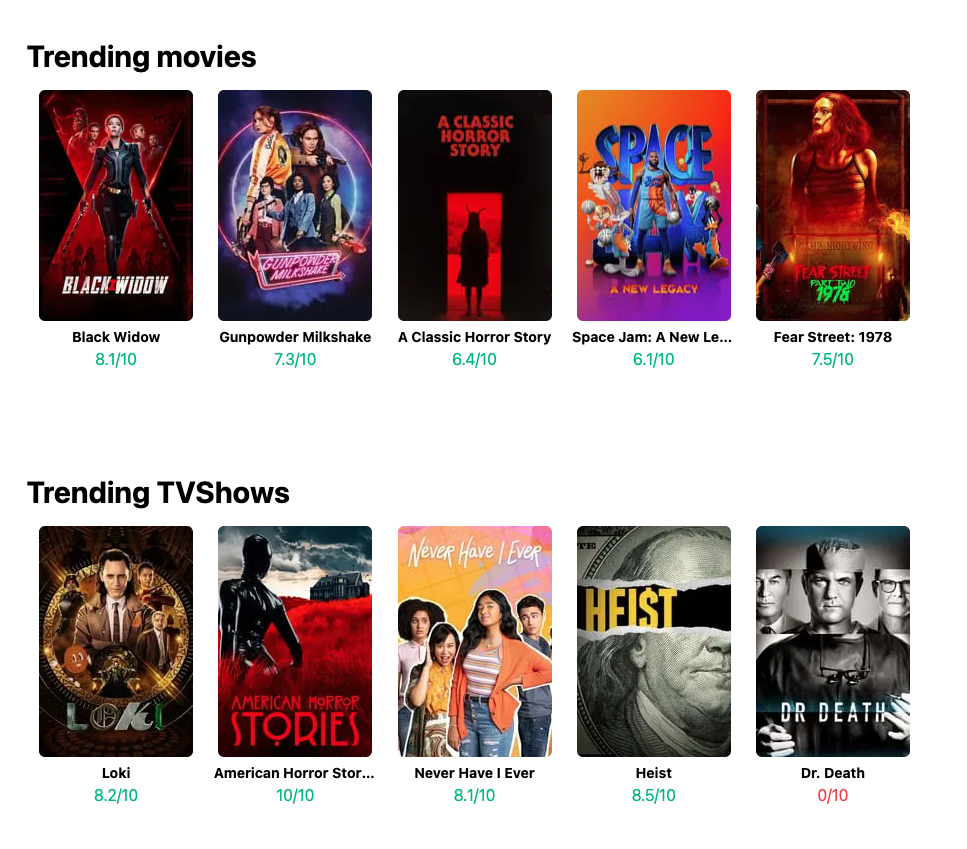

# MobileClub TypeScript / React / GraphQL assessment

> Create a simple page that displays trending movies and tvshows from TMDB and can search for a media

## GraphQL Endpoint

* https://tmdb.apps.quintero.io/

## Libraries

* [nextjs](https://nextjs.org/docs)
* [react-apollo](https://www.apollographql.com/docs/react/get-started/)
* [tailwindcss](https://tailwindcss.com/docs)

## Expected Result

